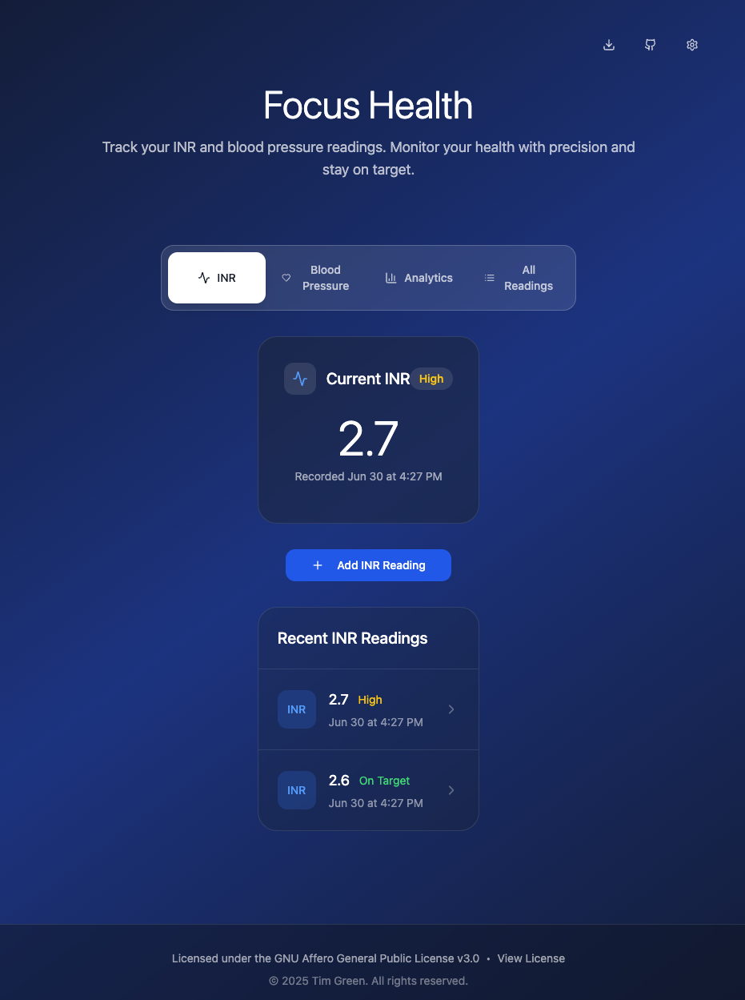

<div align="center">

# Focus Health 🩺

**A modern, intuitive health tracking application for monitoring INR (International Normalized Ratio) and blood pressure readings.**

[](https://www.gnu.org/licenses/agpl-3.0)
[](https://reactjs.org/)
[](https://www.typescriptlang.org/)
[](https://tailwindcss.com/)
[](https://focushealth.rawveg.co.uk)


[🚀 Live Demo](https://focushealth.rawveg.co.uk) • [📖 Documentation](#features) • [🐛 Report Bug](https://github.com/rawveg/focus-health/issues) • [💡 Request Feature](https://github.com/rawveg/focus-health/issues)

---

*Built with React, TypeScript, and Tailwind CSS, featuring a beautiful gradient interface inspired by Apple's design principles.*

</div>





## 🌟 Features

### 📊 Health Tracking
- **INR Monitoring**: Track warfarin anticoagulation therapy with configurable target values
- **Blood Pressure Tracking**: Monitor systolic, diastolic, and optional pulse readings
- **Smart Status Indicators**: Helpful, non-alarming status messages ("Contact Clinic" vs "Critical")
- **Persistent Data Storage**: All data saved locally using browser localStorage

### 🎨 Modern Interface
- **Focus-Style Navigation**: Horizontal tab bar with smooth transitions
- **Beautiful Gradient Background**: Professional slate-to-blue gradient design
- **Glass-morphism Cards**: Modern backdrop blur effects and subtle borders
- **Responsive Design**: Works perfectly on desktop, tablet, and mobile devices
- **Dark/Light Theme Support**: System-aware theme switching

### 📈 Advanced Analytics
- **Time in Therapeutic Range (TTR)**: Critical metric for warfarin management
- **Trend Analysis**: Visual indicators showing if readings are improving or declining
- **Statistical Summaries**: Average, minimum, maximum values with percentages
- **30-Day Analysis**: Recent performance tracking
- **Blood Pressure Categories**: Normal, elevated, and contact doctor classifications

### 🔧 Smart Features
- **Configurable INR Targets**: Set your prescribed target (e.g., 2.5, 3.0)
- **Tight Tolerance Monitoring**: ±0.2 for normal, ±0.4 for monitoring
- **Reading Management**: Edit, delete, and view detailed reading history
- **Data Export**: CSV download and clipboard copy for medical appointments
- **Professional Reports**: Summary reports for healthcare providers

### 📱 User Experience
- **Contextual Add Buttons**: Separate "Add Reading" buttons in each relevant tab
- **Separated Concerns**: Dedicated tabs for INR, Blood Pressure, Analytics, and All Readings
- **Tab State Persistence**: Remembers your last viewed tab
- **Form Validation**: Prevents invalid data entry
- **Success Notifications**: Clear feedback for all actions

## 🚀 Live Demo

Try the application at: **[focushealth.rawveg.co.uk](https://focushealth.rawveg.co.uk)**

## 🛠️ Getting Started

### Prerequisites
- Node.js 18+ 
- npm or yarn package manager

### Installation

1. **Clone the repository**
   ```bash
   git clone https://github.com/rawveg/focus-health.git
   cd focus-health
   ```

2. **Install dependencies**
   ```bash
   npm install
   ```

3. **Start the development server**
   ```bash
   npm run dev
   ```

4. **Open your browser**
   Navigate to `http://localhost:5173`

### Building for Production

```bash
npm run build
```

The built files will be in the `dist` directory.

## 📖 How to Use

### Initial Setup
1. **Configure Your Target INR**: Click the settings icon and set your prescribed INR target (e.g., 2.5)
2. **Choose Your Theme**: Select light, dark, or system theme preference

### Adding Readings

#### INR Readings
1. Navigate to the **INR** tab
2. Click **"Add INR Reading"**
3. Enter your INR value (e.g., 2.4)
4. Click **"Add Reading"**

#### Blood Pressure Readings
1. Navigate to the **Blood Pressure** tab
2. Click **"Add BP Reading"**
3. Enter systolic and diastolic values
4. Optionally add pulse rate
5. Click **"Add Reading"**

### Viewing Analytics
- Navigate to the **Analytics** tab to see:
  - Percentage of readings in target range
  - Time in therapeutic range (TTR)
  - Statistical summaries
  - Blood pressure categorization

### Managing Data
- **View All Readings**: Use the "All Readings" tab
- **Edit Readings**: Click any reading to view details and edit
- **Export Data**: Use the download icon to export CSV or copy reports
- **Delete Readings**: Use the edit dialog to remove incorrect entries

## 🏗️ Technical Architecture

### Tech Stack
- **Frontend**: React 18 with TypeScript
- **Styling**: Tailwind CSS with custom gradient themes
- **UI Components**: shadcn/ui component library
- **Icons**: Lucide React
- **Build Tool**: Vite
- **State Management**: React hooks with localStorage persistence

### Key Components
- `Index.tsx` - Main application with tab navigation
- `StatCard.tsx` - Reusable metric display cards
- `ReadingItem.tsx` - Individual reading list items
- `SettingsDialog.tsx` - Configuration modal
- `AnalyticsDialog.tsx` - Detailed analytics view
- `ExportDialog.tsx` - Data export functionality
- `ThemeProvider.tsx` - Theme management

### Data Structure
```typescript
interface Reading {
  id: string;
  type: "inr" | "bloodPressure";
  value?: number;           // INR value
  systolic?: number;        // BP systolic
  diastolic?: number;       // BP diastolic
  pulse?: number;           // Optional pulse
  date: string;             // ISO timestamp
  timestamp: number;        // Unix timestamp
}

interface Settings {
  targetINR: number;        // User's prescribed target
}
```

## 🤝 Contributing

We welcome contributions! Please follow these guidelines:

### Development Setup
1. Fork the repository
2. Create a feature branch: `git checkout -b feature/amazing-feature`
3. Make your changes
4. Run tests: `npm test`
5. Commit changes: `git commit -m 'Add amazing feature'`
6. Push to branch: `git push origin feature/amazing-feature`
7. Open a Pull Request

### Code Standards
- **TypeScript**: All new code must be properly typed
- **ESLint**: Follow the existing linting rules
- **Prettier**: Use consistent code formatting
- **Components**: Create small, focused, reusable components
- **Accessibility**: Ensure all features are keyboard and screen reader accessible

### Commit Messages
Use conventional commits:
- `feat:` New features
- `fix:` Bug fixes
- `docs:` Documentation changes
- `style:` Code style changes
- `refactor:` Code refactoring
- `test:` Test additions/changes

### Pull Request Process
1. Update documentation for any new features
2. Add tests for new functionality
3. Ensure all tests pass
4. Update the README if needed
5. Request review from maintainers

## 📋 Roadmap

### Planned Features
- [ ] **Data Sync**: Cloud backup and multi-device sync
- [ ] **Medication Tracking**: Warfarin dose logging
- [ ] **Appointment Reminders**: INR test scheduling
- [ ] **Trend Charts**: Visual graphs of reading history
- [ ] **PDF Reports**: Professional medical reports
- [ ] **Multiple Users**: Family member tracking
- [ ] **API Integration**: Healthcare provider connections
- [ ] **Mobile App**: Native iOS/Android applications

### Medical Enhancements
- [ ] **Dose Calculator**: Warfarin adjustment suggestions
- [ ] **Risk Indicators**: Bleeding/clotting risk assessment
- [ ] **Drug Interactions**: Medication conflict warnings
- [ ] **Clinical Guidelines**: Built-in reference materials

## 🔒 Privacy & Security

- **Local Storage Only**: All data stored locally in your browser
- **No Cloud Sync**: No data transmitted to external servers
- **No Tracking**: No analytics or user tracking implemented
- **Open Source**: Full transparency with AGPL v3 license

## ⚖️ License

This project is licensed under the GNU Affero General Public License v3.0 (AGPL-3.0).

**What this means:**
- ✅ **Free to use** for personal and commercial purposes
- ✅ **Free to modify** and distribute
- ✅ **Free to study** the source code
- ⚠️ **Must share modifications** if you distribute the software
- ⚠️ **Must provide source code** if you run it as a web service
- ⚠️ **Must use same license** for derivative works

See the [LICENSE](LICENSE) file for full details.

## 🙏 Acknowledgments

- **Design Inspiration**: Tim Green's Focus app and Apple's Human Interface Guidelines
- **Medical Guidance**: Anticoagulation therapy best practices
- **Component Library**: shadcn/ui for beautiful, accessible components
- **Icons**: Lucide React for consistent iconography

## 📞 Support

- **Issues**: [GitHub Issues](https://github.com/rawveg/focus-health/issues)
- **Discussions**: [GitHub Discussions](https://github.com/rawveg/focus-health/discussions)
- **Live Demo**: [focushealth.rawveg.co.uk](https://focushealth.rawveg.co.uk)

## ⚠️ Medical Disclaimer

**Important**: This application is for tracking purposes only and should not replace professional medical advice. Always consult with your healthcare provider or anticoagulation clinic before making any changes to your medication or treatment plan.

---

**Made with ❤️ for the warfarin community**

*Helping patients take control of their anticoagulation therapy with beautiful, intuitive tools.*
